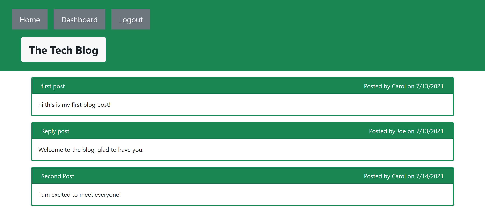

# Tech_Blog_V1
## Description
This website is a basic forum or blogging application that allows people to make posts, and comment on eachother posts. The website is able to store account data and allow people to log in while protecting user posts from other users. This project demonstrated my ability to program a fully functioning app using the MVC paradigm.
## Table of Contents
- [Installation](#installation)
- [Usage](#usage)
- [Credits](#credits)
- [License](#license)
## Installation
Deployed Link:
## Usage

Sign up an account or log into an existing account on the webpage, then use the dashboard to make, edit, or delete posts. Go the home page to comment on posts.
## Credits
https://github.com/Randy-chou
## License

## Features
After logging into or signing up for the website you can make posts into the blog, edit or delete those posts on the dashboard. You can also make comments on each post. After a period of time, you will be automatically logged out of your session and need to login again. If you aren't logged in you can only view posts and comments, any attempt to access the dashboard will redirect you to the login page.
## How to Contribute
N/A
## Tests
N/A